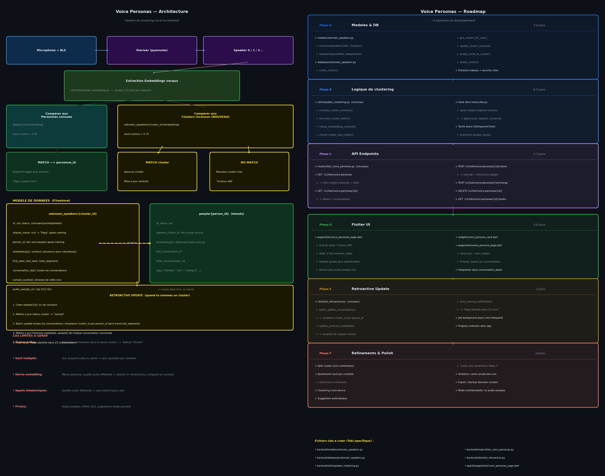

# Voice Personas — Plan de conception & Roadmap

> Feature inspirée de "Personnes" dans Apple Photos.
> Les voix inconnues sont automatiquement clusterisées et présentées à l'utilisateur qui peut les nommer ou les supprimer.



---

## Vision

Quand Toki enregistre une voix qu'il ne reconnaît pas, il ne la jette pas — il la garde dans une liste "Voix non identifiées". Chaque voix est regroupée par similarité (même inconnue apparaissant dans plusieurs conversations = 1 cluster). L'utilisateur peut à tout moment ouvrir cette liste, écouter un extrait, lire des citations, et nommer la voix. Une fois nommée, **toutes** les conversations passées sont rétroactivement taguées.

---

## Architecture

### Pipeline de traitement

```
Audio chunk
  ↓
Diarizer (pyannote) → Speaker 0 / Speaker 1 / Speaker 2...
  ↓
Extraction embedding vocal (512-dim) par segment
  ↓
Comparaison cosinus contre people/{id}/embeddings (seuil 0.82)
  ├── MATCH → segment tagué avec person_id (prénom connu)
  └── NO MATCH
        ↓
        Comparaison contre unknown_speakers/{cluster_id}/embeddings (seuil 0.75)
        ├── MATCH cluster → ajout au cluster, mise à jour centroid
        └── NO MATCH → nouveau cluster "Inconnu #N"
```

### Algorithme de clustering

- **Représentation** : centroid mobile (moyenne de N embeddings)
  → Robuste aux variations de qualité audio (téléphone vs micro direct)
- **Seuil cosinus** : 0.75 pour clustering, 0.82 pour matching personnes connues
- **Seuil contexte** : ajustable selon l'environnement (bruyant = seuil abaissé)
- **Merge** : si deux clusters s'avèrent être la même personne → fusion manuelle

---

## Modèle de données

### `users/{uid}/unknown_speakers/{cluster_id}`

```json
{
  "id": "cluster_abc123",
  "uid": "user_xyz",
  "status": "unknown",          // unknown | named | deleted
  "display_name": null,         // null jusqu'au naming
  "person_id": null,            // lien vers people/{id} après naming

  "embeddings": [[...], [...]], // plusieurs vecteurs 512-dim
  "embedding_count": 5,

  "first_seen": "2026-03-20T09:14:00Z",
  "last_seen": "2026-03-27T18:32:00Z",
  "total_segments": 47,
  "total_duration_seconds": 183.5,

  "conversation_ids": ["conv_1", "conv_2", "conv_7"],

  "sample_quotes": [
    {
      "text": "t'as vu le match hier soir ?",
      "conversation_id": "conv_1",
      "timestamp": "2026-03-20T09:14:22Z"
    }
  ],

  "audio_sample_url": "gs://toki-speech-profiles/clusters/cluster_abc123.wav",

  "created_at": "2026-03-20T09:14:00Z",
  "updated_at": "2026-03-27T18:32:00Z"
}
```

### `users/{uid}/people/{person_id}` (étendu depuis Omi)

Champs ajoutés par Toki :
```json
{
  "speaker_cluster_id": "cluster_abc123",
  "embeddings": [[...], [...]],
  "first_conversation_at": "2026-03-20T09:14:00Z",
  "total_conversations": 14,
  "tags": ["famille", "ami"]
}
```

---

## API Endpoints

Tous sous le préfixe `/v1/toki/voice-personas`

| Method | Path | Description |
|--------|------|-------------|
| GET | `/` | Liste tous les clusters de l'utilisateur (`status=unknown`) |
| GET | `/{id}` | Détail d'un cluster + liste de ses conversations |
| GET | `/{id}/audio` | URL signée pour l'audio sample (5s) |
| POST | `/{id}/name` | Nommer un cluster → déclenche retroactive update |
| POST | `/{id}/merge/{other_id}` | Fusionner deux clusters confondus |
| DELETE | `/{id}` | Supprimer un cluster (status → deleted) |

### Payload POST `/{id}/name`
```json
{
  "name": "Papa",
  "person_id": null,          // null = créer nouvelle personne
  "tags": ["famille"]
}
```

---

## Retroactive Update

Déclenché à chaque naming. Exécuté en tâche background (non bloquant).

```python
# Ordre d'exécution dans utils/toki_retroactive.py
1. Créer people/{id} (ou lier si person_id fourni)
2. Mettre à jour cluster: status → "named", person_id renseigné
3. Batch update Firestore: conversations où cluster_id apparaît
   → remplacer cluster_id par person_id dans transcript_segments[]
4. Batch update Pinecone: metadata people[] pour chaque vecteur concerné
5. Push notification: "Papa identifié dans 23 conversations"
```

---

## Fichiers à créer / modifier

### Nouveaux fichiers (Toki-spécifique, pas de conflit upstream)

| Fichier | Rôle |
|---------|------|
| `backend/models/unknown_speakers.py` | Modèles Pydantic : `UnknownSpeakerCluster`, `SampleQuote`, `NamingRequest` |
| `backend/database/unknown_speakers.py` | CRUD Firestore pour les clusters |
| `backend/utils/speaker_clustering.py` | Logique cosinus, centroid, matching |
| `backend/routers/toki_voice_personas.py` | Endpoints API |
| `backend/utils/toki_retroactive.py` | Batch update post-naming |
| `app/lib/pages/toki/voice_personas_page.dart` | Écran "Voix non identifiées" |
| `app/lib/pages/toki/name_persona_page.dart` | Flow de naming |
| `app/lib/widgets/voice_persona_card.dart` | Card individuelle |

### Fichiers Omi à modifier (modifications minimales, risque conflit faible)

| Fichier | Modification |
|---------|-------------|
| `backend/utils/speaker_identification.py` | Appeler `speaker_clustering.py` quand pas de match dans `people/` |
| `backend/routers/transcribe.py` | Déclencher clustering async après chaque segment inconnu |
| `backend/main.py` | Inclure le nouveau router `toki_voice_personas` |

---

## Roadmap

### Phase A — Modèles & DB `3-4 jours`
- [x] `models/unknown_speakers.py` : `UnknownSpeakerCluster`, `SampleQuote`, `NamingRequest`, `MergeRequest`
- [x] `database/unknown_speakers.py` : `create_cluster()`, `get_clusters_for_user()`, `get_cluster_by_id()`, `update_cluster_embeddings()`, `add_conversation_to_cluster()`, `assign_name_to_cluster()`, `merge_clusters()`, `delete_cluster()`
- [x] Firestore indexes + security rules (`deploy/firestore.indexes.json` + `deploy/firestore.rules`)
- [x] Tests unitaires des modèles (38 tests, 38 passed)

### Phase B — Logique de clustering `4-5 jours`
- [x] `utils/speaker_clustering.py` : `compute_cosine_distance()`, `find_best_cluster_match()`, `should_create_new_cluster()`, `extract_sample_quote()`, `route_unknown_segment()`
- [x] Hook dans `routers/transcribe.py` : `asyncio.create_task(route_unknown_segment(...))` au `else` du speaker matching
- [ ] Upload audio sample (5s) vers GCS bucket `BUCKET_SPEECH_PROFILES`
- [x] Tests : 28 tests clustering (math + cas limites), 66 tests total passent

### Phase C — API Endpoints `2-3 jours`
- [x] `routers/toki_voice_personas.py` avec les 6 endpoints (GET liste, GET détail, GET audio, POST name, POST merge, DELETE)
- [x] Auth middleware (uid depuis Firebase token via `get_current_user_uid`)
- [x] Validation des payloads (Pydantic — NamingRequest, MergeRequest)
- [x] Gestion d'erreurs et edge cases (404, 422, deleted cluster guard)
- [x] Inclure router dans `main.py` (prefix `/v1/toki/voice-personas`)
- [x] 22 tests router → 88 tests Toki au total passent

### Phase D — Flutter UI `5-6 jours`
- [x] `app/lib/backend/schema/toki_voice_persona.dart` : `VoicePersona`, `SampleQuote`, `PersonTag`, `ClusterStatus`, `durationLabel`
- [x] `app/lib/backend/http/api/toki_voice_personas.dart` : `getVoicePersonas()`, `nameVoicePersona()`, `deleteVoicePersona()`, `mergeVoicePersonas()`, `getAudioSampleUrl()`
- [x] `app/lib/providers/toki_voice_personas_provider.dart` : `VoicePersonasProvider` (`loadPersonas`, `namePersona`, `deletePersona`, `mergePersonas`), optimistic updates, processing set
- [x] `app/lib/widgets/voice_persona_card.dart` : avatar dégradé, stats conv+durée, quote preview, bouton delete, overlay loading
- [x] `app/lib/pages/toki/voice_personas_page.dart` : grid 2 colonnes, pull-to-refresh, empty state, error state, confirmation suppression
- [x] `app/lib/pages/toki/name_persona_page.dart` : input nom validé, sélecteur de tags, aperçu quotes, bouton save avec feedback
- [x] `VoicePersonasProvider` enregistré dans `MultiProvider` (`main.dart`)
- [x] Entrée navigation dans `settings_drawer.dart` : "Voix non identifiées" après le profil
- [ ] Player audio intégré pour écouter l'extrait vocal (Phase F)
- [ ] Intégration dans `conversation_detail` : speaker "?" avec tap → naming flow (Phase F)

### Phase E — Retroactive Update `2 jours`
- [x] `utils/toki_retroactive.py` : `run_retroactive_update()`, `_batch_update_firestore_segments()`, `_update_pinecone_metadata()`, `_send_naming_notification()`
- [x] Job async non bloquant (BackgroundTasks FastAPI dans le router /name)
- [x] Push notification FCM post-naming ("Papa identifié dans 23 conversations")
- [x] Gestion des erreurs best-effort (chaque étape isolée, erreurs collectées sans abort)
- [x] `per_conversation_speakers` stocké dans le cluster pour cibler les bons segments
- [x] `database/unknown_speakers.py` : `record_speaker_id_for_conversation()`
- [x] 15 tests retroactive → 103 tests Toki au total

### Phase F — Refinements `continu`
- [x] `app/lib/widgets/toki_audio_player.dart` : player play/stop pour les extraits audio 5s (just_audio)
- [x] Bouton play dans `VoicePersonaCard` (grid) et `NamePersonaPage` (header)
- [x] Backend : `GET /v1/toki/voice-personas/lookup?conversation_id=X&speaker_id=Y` → trouve le cluster par segment
- [x] `per_conversation_speakers` ajouté à `UnknownSpeakerCluster` Pydantic model
- [x] Flutter API : `lookupClusterForSegment(convId, speakerLabel)` dans `toki_voice_personas.dart`
- [x] `TranscriptWidget` : paramètre optionnel `onTokiIdentify` + bouton "?" sur les voix non identifiées
- [x] `conversation_detail/page.dart` : tap "?" → lookup cluster → navigate vers `NamePersonaPage` ou `VoicePersonasPage`
- [x] 5 tests lookup → 108 tests Toki au total
- [x] Split cluster : `POST /{id}/split` + `GET /{id}/conversations` + `SplitPersonaPage` Flutter, accès depuis `NamePersonaPage`, 7 tests
- [x] Suggestion automatique : "C'est Papa ?" — `SUGGESTION_THRESHOLD = 0.18`, fire-and-forget après chaque segment, bannière Oui/Non dans la card, 2 endpoints confirm/reject, 12 tests
- [x] Seuil dynamique par contexte : `estimate_threshold_for_segment()` — proxy WPS → multiplicateur 1.4×/0.9×, caps 0.15–0.50, 8 tests
- [ ] Analytics : carte sociale des voix ("Tu parles le plus avec...")
- [ ] Mode confidentialité : pas de stockage audio samples

---

## Cas limites à gérer

| Cas | Solution |
|-----|----------|
| Cluster pollué (2 voix confondues) | Feature "Diviser" en Phase F |
| Seuil inadapté (café bruyant) | Seuil contextuel ajustable |
| Dérive embedding (qualité audio) | Centroid sur 5+ échantillons |
| Appels téléphoniques (codec différent) | Seuil distinct pour appels |
| Privacy RGPD | Audio chiffrés, suppression totale possible |
| Même personne, appareils différents | Embeddings multi-sources dans le cluster |

---

## Statut

| Phase | Statut | Notes |
|-------|--------|-------|
| A — Modèles & DB | ✅ Terminé | Models, DB, indexes, rules, 38 tests ✓ |
| B — Clustering | ✅ Terminé | speaker_clustering.py + hook transcribe.py, 66 tests ✓ |
| C — API | ✅ Terminé | 6 endpoints, auth, 88 tests ✓ |
| D — Flutter UI | ✅ Terminé | Schema+API+Provider+Card+Pages+Settings entry, 103 tests ✓ |
| E — Retroactive Update | ✅ Terminé | toki_retroactive.py, Firestore+Pinecone+FCM, 103 tests ✓ |
| F — Refinements | ✅ Terminé | Player audio, conv_detail, suggestion auto, split cluster, seuil dynamique — 127 tests ✓ |

---

*Document maintenu par [@Tmauc](https://github.com/Tmauc) — dernière mise à jour : 2026-03-27*
